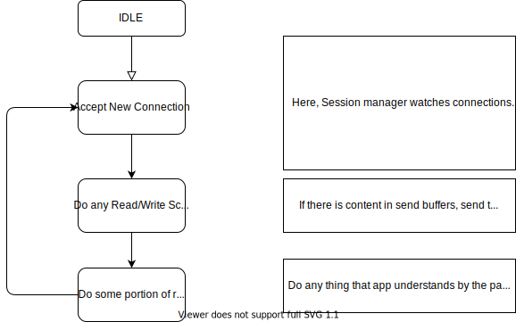

Anatomy and run flow
====================
This module is written in totaly async manner. async apps running on real high
level machines dont care about memory or cpu beacause they are chip to them. but
for an embedded system, any use of every KB of ram, closes sytem to saturation.
Fortunatelly, micropython supports async/await operations so we can implement
routines in async fashion. the overal run flow of event loop is as this:

